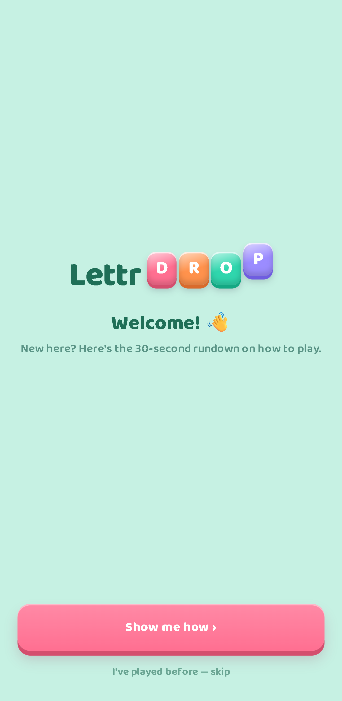
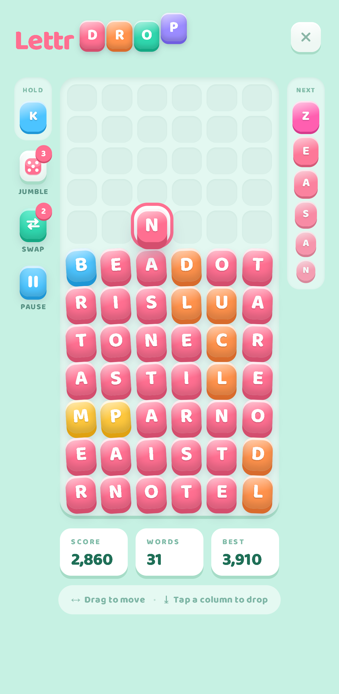

# LettrDrop

A mobile-first falling-letters word game — think Tetris meets Scrabble. Letter tiles drop one at a time into a 6-column, 12-row well. Drag to position, double-tap to drop. When adjacent tiles spell a real word (horizontally or vertically, 3+ letters), the word clears after a short grace window, tiles collapse under gravity, and chain reactions can cascade for bonus points.

<p align="center">
  
  &nbsp;&nbsp;&nbsp;
  
</p>

## How to Play

- **Drag** a falling tile left or right to position it
- **Double-tap** a column to instantly drop the tile there
- Words form automatically when 3+ adjacent letters spell a dictionary word
- A **grace window** gives you time to extend a word before it commits
- The game ends when the well fills to the top

## Features

- **Hold slot** — stash a letter for later and swap it back in
- **Next queue** — see the upcoming 6 tiles on the right rail
- **Jumble** — shuffle all settled tiles on the board (limited uses, recharges over time)
- **Swap** — replace the active tile with a new random letter, restarting it from the top
- **Pause overlay** with blur effect
- **Speed levels** — gravity accelerates as you play (every 25 moves or 5 minutes)
- **Revive** — one chance to clear the bottom 4 rows and keep going (via rewarded ad)
- **High scores** — local best tracking with new-best celebration, plus server leaderboard
- **Guest-friendly** — play without an account; sign up to save scores to the cloud

## Tech Stack

- **React 19** + **Vite 8** — fast dev with HMR
- **Redux Toolkit** — session, settings, and profile state
- **Supabase** — email auth, score persistence, leaderboard queries
- **Capacitor** — native mobile shell (iOS / Android)
- **Pure CSS** — candy-style design with no component library

## Getting Started

```bash
npm install
npm run dev
```

The dev server starts at `http://localhost:5173` (or the next available port).

## Project Structure

```
src/
  engine/       Game logic — config, letter pool, word scanner, core engine hook
  components/   UI — DropBoard, DropInGame, HoldSlot, VNext, overlays
  pages/        Route pages — Auth, Home, Play, Results, HighScores, Profile
  hooks/        Auth listener, touch input
  services/     Supabase client, auth, leaderboard API
  store/        Redux slices (session, settings, profile)
```

## License

Private — not open source.
